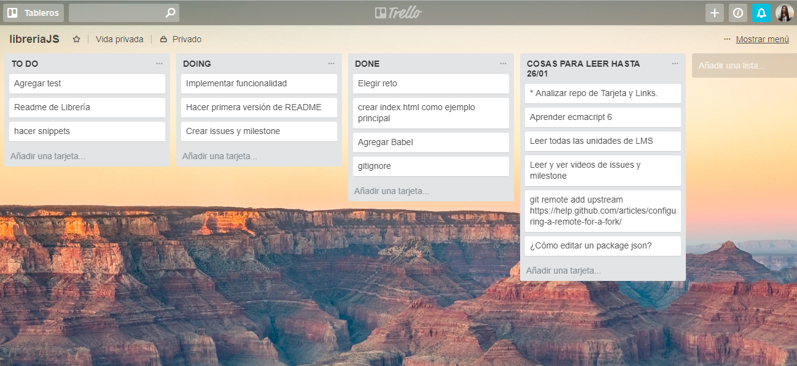

# Valida datos de tarjetas de crédito

* **Track:** _Common Core_
* **Curso:** _JS Deep Dive: Crea tu propia librería usando JavaScript_
* **Unidad:** _Producto final_

***

## Objetivo

El plugin debe recibir una referencia a un elemento del DOM que contenga
`<input>`s con los siguientes nombres (atributo `name`):

* `cn` (Card Number): El número de la tarjeta de crédito
* `exp` (Expiry Date): Fecha de expiración
* `cvv` (Card Verification Value): Código de validación de 3 dígitos
* `name`: Nombre completo como aparece en la tarjeta  

## Planificación  

Se implementa por etapas las tareas establecidas por semanas:

#### ETAPA 1

* Formar equipo.
* Elegir reto.
* Hacer fork de reto modelo o crear nuevo repo si has propuesto un reto no propuesto por Laboratoria.
* Escribir primera versión del `README.md` con una descripción general de la librería así como ejemplos (snippets) de uso y configuración (si fuera necesario).
* Crear issues y milestones que sirvan como hoja de ruta (roadmap)
* Inicializar proyecto con `npm init` y `git init`.
* Crear `index.html` con ejemplo principal de uso.

#### ETAPA 2

* Agregar tests que describan la `API` de tu librería y los casos de uso esperados.
* Implementar funcionalidad esencial.
* Hacer code review con compañeras e instructores.

#### ETAPA 3

* Completar implementación de librería y ejemplo principal (usando la librería).
* Hacer code review con compañeras e instructores.
* Preparar demo/presentación.
* Publicar el ejemplo principal (`index.html`) en GitHub pages.

**Herramienta de planificación - TRELLO**

  

## Herramientas  

* Materialize (Framework).
* jQuery (Librería JS).
* Babel (transpilador).

## Ejemplo

```html
<form>
  <div class="form-group">
    <label for="cn">Número de tarjeta</label>
    <input id="cn" name="cn" />
  </div>
  <div class="form-group">
    <label for="exp">Fecha de vencimiento</label>
    <input id="exp" name="exp" />
  </div>
  <div class="form-group">
    <label for="cvv">CVV</label>
    <input id="cvv" name="cvv" />
  </div>
  <div class="form-group">
    <label for="name">Nombre completo</label>
    <input id="name" name="name" />
  </div>
  <input type="submit" value="Pagar" />
</form>
```

```js
const form = document.querySelector('form');

form.addEventListener('submit', (e) => {
  e.preventDefault();
  if (validateCardDetails(form)) {
    console.log('datos válido... enviar...');
  } else {
    console.log('datos inválidos');
  }
});
```

A la hora de hacer las validaciones, la librería debería de añadir la clase
`.error` a los `<input>`s que no pasen la validación, o la clase `.success`
en caso de que sí pase.
